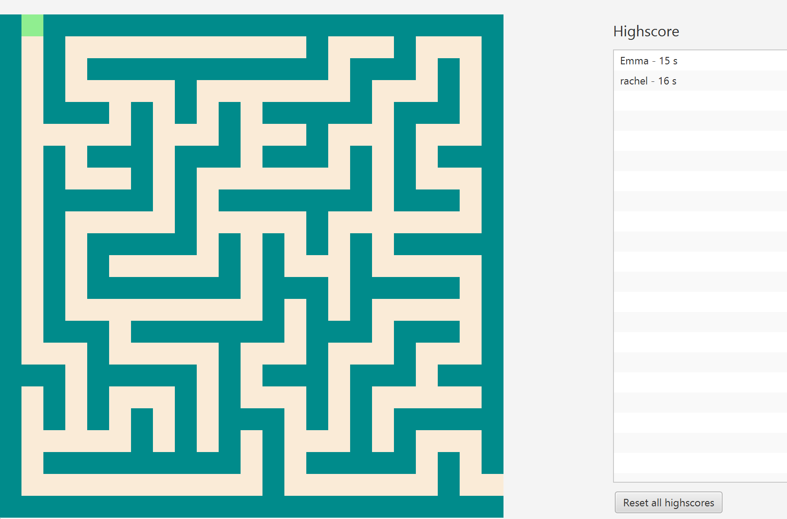

# Labyrinth Game

A desktop labyrinth game built with Java and JavaFX.

The player navigates through a maze using the arrow keys while the game
tracks the completion time. Finished runs can be saved to a persistent
highscore list and compared with previous attempts.



## Features

- Interactive maze rendered with JavaFX
- Keyboard movement using the arrow keys
- Collision detection for maze walls
- Completion timer
- Persistent highscore system
- Highscore sorting by completion time
- Maze loaded from a text file
- Unit tests with JUnit

## Technologies

- Java 21
- JavaFX
- FXML
- Maven
- JUnit 5

## Project Structure

The application separates the game logic from the JavaFX user interface.

- `LabyrinthGame` – game state, movement rules and timing
- `Player` – player position and movement
- `LabyrinthController` – connects the JavaFX UI to the game logic
- `LabyrinthFileHandler` – reading mazes and storing highscores
- `Highscore` – represents and compares highscore entries
- `Movable` – interface for movable game objects

## Running the Game

### Requirements

- Java 21
- Maven

Clone the repository:

```bash
git clone https://github.com/YOUR_USERNAME/labyrinth-game.git
cd labyrinth-game
```

Run the application:

```bash
mvn javafx:run
```

## Controls

Use the **arrow keys** to navigate through the labyrinth.

Reach the finish as quickly as possible. When the maze is completed,
you can enter your name and your completion time will be added to the
highscore list.

## Testing

Run the tests with:

```bash
mvn test
```

The project contains unit tests for the core game logic, player movement,
highscores and file handling.

## Known Limitations & Planned Improvements

The current version was developed within the scope and timeframe of a
university project. Some features and improvements were planned but were
not implemented in the initial version.

- **Restart functionality:** After completing a game, the application
  currently needs to be restarted to play again. A planned improvement is
  to add a restart/new game option directly in the user interface.

- **Moving obstacles/enemies:** A planned gameplay feature is to introduce
  moving hazards that navigate through the labyrinth, inspired by the
  enemies in games such as Pac-Man. Colliding with one of these hazards
  would cause the player to lose or restart the game. This feature may be
  added in a future version.

## About

This project was developed as part of the Object-Oriented Programming
course (TDT4100) at NTNU.

The project gave me practical experience with object-oriented design,
JavaFX, event-driven user interfaces, file handling and unit testing.